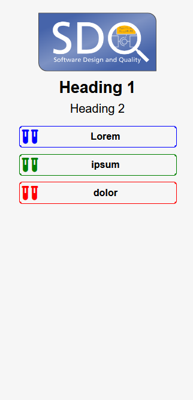

# Minimal Landing Page Template

|  |  |
|-|-|

## Customization

### Logo

Change the logo by replacing the src of the image on line 14.
https://github.com/kit-sdq/MinimalLandingPageTemplate/blob/07bbb766efe73ca25c28ee12e319f1f9091386a1/index.html#L14


### Favicon

To change the favicon replace the href of the link on line 9 with your desired favicon.

### Title

Change the tile by replacing the text on line 6.

https://github.com/kit-sdq/MinimalLandingPageTemplate/blob/07bbb766efe73ca25c28ee12e319f1f9091386a1/index.html#L6

The two headings can be changed on lines 17 and 18.
https://github.com/kit-sdq/MinimalLandingPageTemplate/blob/14af47a2d5fb66e8c65dff5f2c1312db744f03b8/index.html#L17-L18

### Adding a link

To add a new link copy the following code and paste it into `div#link-list`, so that the link is placed in the desired place.

```html
<a href="" class="link-N icon">
  <i class="fa-solid fa-vials"></i>
</a>
<a href="" class="link-N text">
  <span class="title">Title</span> <span class="desc">Longer describtion</span>
</a>
```

Change the `href` of both links to the desired location.
In the `i` change the icon to be the desired Font Awesome icon.
Change the text in the spans with class `title` and `desc` to the desired text.
`title` is the short description that is always displayed on mobile and colorful on desktop.
`desc` is the longer description that is only displayed on desktop.

Add this code to the style section:
```css
.link-N {
  --col: #000;
}
```

Change the value of the `--col` variable to the desired color of the icon.
You can change the `N` in the class name to any desired text. Make sure to also adjust this class accordingly in the html you pasted previously.

Lastly change the `--link-count` variable to the new total link count:
https://github.com/kit-sdq/MinimalLandingPageTemplate/blob/14af47a2d5fb66e8c65dff5f2c1312db744f03b8/index.html#L45

### Icon size
The icon size on the desktop can be changed here:
https://github.com/kit-sdq/MinimalLandingPageTemplate/blob/14af47a2d5fb66e8c65dff5f2c1312db744f03b8/index.html#L46
